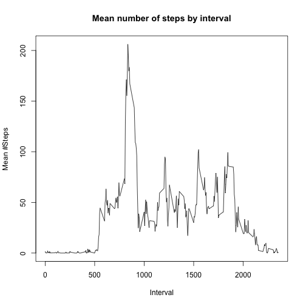
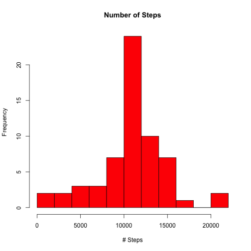

This is my submission to the Peer Assessment 1
==============================================

We forked the RepData_PeerAssessment1 repo, cloned it and set the resulting directory as the working directory.

## Loading the required packages

We load all the packages we will use in this assignment


```r
library(dplyr)
library(lattice)
```

## Loading and preprocessing the data

We load the data (using read.csv()) and transform it to a tbl (dplyr package)


```r
activity<-read.csv("/Users/josepboludaescandell/coursera/data/reproducible_research/RepData_PeerAssessment1/activity.csv",colClasses=c(date="Date"))
activity<-tbl_df(activity)
```

**This step will not work unless you have the data stored in the exact same location as I do**

##What is mean total number of steps taken per day?

We first plot a green histogram with the number of steps taken per day.

To do that:  

* We group_by() the data by Date

* We use the summarize function to find the total number of steps taken per day

* We plot a green histogram with breaks set equal to 25

**Note that we use na.rm=TRUE in our call to summarize(), that will place days with NA values in the bin with 0**


```r
activityByDate<-group_by(activity,date)
stepsByDay<-summarize(activityByDate,SumSteps=sum(steps,na.rm=TRUE))
hist(stepsByDay$SumSteps,col="green",xlab="Steps",main="Histogram of number of steps",breaks=25)
```

 

We now calculate and report the mean of the number of steps taken per day.


```r
summarize(stepsByDay,mean=mean(SumSteps,na.rm=T),median=median(SumSteps,na.rm=T))
```

```
## Source: local data frame [1 x 2]
## 
##      mean median
## 1 9354.23  10395
```

##What is the average daily activity pattern?

Make a time series plot (i.e. type = "l") of the 5-minute interval (x-axis) and the average
number of steps taken, averaged across all days (y-axis)


```r
stepsByInterval<-group_by(activity,interval)
meanStepsByInterval<-summarize(stepsByInterval,mean=mean(steps,na.rm=T))
with(meanStepsByInterval,plot(interval,mean,type="l",xlab="Interval",ylab="Mean #Steps",main="Mean number of steps by interval"))
```

 

##Which 5-minute interval, on average across all the days in the dataset, contains the maximum number of steps?

To solve this question:

1. We find the index containing the maximum value first using which.max() and store it in a variable

2. We return the row containing the highest number of steps


```r
indexMaxMeanSteps<-which.max(meanStepsByInterval$mean)
meanStepsByInterval[indexMaxMeanSteps,]
```

```
## Source: local data frame [1 x 2]
## 
##   interval     mean
## 1      835 206.1698
```

##Imputing missing values

Calculating the total number of missing values is pretty straightforward. We'll use sum() together with the is.na() function.


```r
sum(is.na(activity$steps))
```

```
## [1] 2304
```

We are going to substitues all NA values by the mean in that standard day. For that, we will use a for loop.


```r
# We first define a function that substitutes every NA value by the mean number of steps of that interval across all days
f<-function(){
    activity_final<-activity
    for(i in seq(nrow(activity_final))){
        if(is.na(activity_final[[i,1]])){
            # We define the right index in the meanStepsByInterval table
            interval_index<-which(meanStepsByInterval[,1]==activity_final[[i,3]])
            activity_final[[i,1]]<-meanStepsByInterval[[interval_index,2]]
        }
    }
    activity_final
}
# We assign the result of that function to a new data set
activityWithoutNA<-f()
```

We now make a histogram of the total number of steps taken each day and calculate the mean 
and median total number of steps taken per day.


```r
activityWithoutNA<-group_by(activityWithoutNA,date)
stepsByDayNoNA<-summarize(activityWithoutNA,Steps=sum(steps))
hist(stepsByDayNoNA$Steps,col="red",xlab="# Steps",main="Number of Steps",breaks=15)
```

 

```r
summarize(stepsByDayNoNA,Mean=mean(Steps),Median=median(Steps))
```

```
## Source: local data frame [1 x 2]
## 
##       Mean   Median
## 1 10766.19 10766.19
```

Both the mean and the median increase.

##Are there differences in activity patterns between weekdays and weekends?

We use the functions weekdays(), which(), mutate() and as.factor() to create a new factor variable with two levels "weekday" and "weekend" 


```r
activityWithoutNA<-mutate(activityWithoutNA,Weekend=(weekdays(date)=="Saturday"|weekdays(date)=="Sunday"))
activityWithoutNA$Weekend[which(activityWithoutNA$Weekend==FALSE)]="weekday"
activityWithoutNA$Weekend[which(activityWithoutNA$Weekend==TRUE)]="weekend"
activityWithoutNA$Weekend<-as.factor(activityWithoutNA$Weekend)
# We do the next step to reinitiate any group_by we may have
activityWithoutNA<-tbl_df(activityWithoutNA)
# We now group by interval and by Weekend
activityWithoutNA<-group_by(activityWithoutNA,Weekend,interval)
meanStepsByIntervalByWeekend<-summarize(activityWithoutNA,Steps=mean(steps))
```

We generate the two required plots using the lattice package


```r
xyplot(Steps~interval|Weekend,data=meanStepsByIntervalByWeekend,type="l",layout=c(1,2),ylab="Number of steps")
```

 
